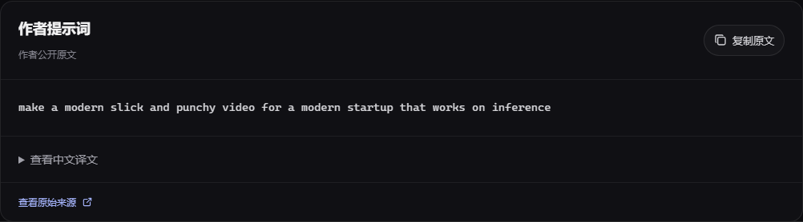

<div align="center">


# 动效灵感

**看见好作品，找到下一次创作的起点。**

一个可以直接浏览、搜索和拆解创作资料的中文 AI 动效画廊。

[在线体验](https://fangx-ai.github.io/motion-library/) · [快速运行](#快速运行) · [提示词正文](#提示词正文) · [设计来源](DESIGN-SOURCES.md)


</div>


<p align="center"><sub>从作品封面进入详情，继续查看作者、原帖、源码和公开提示词。</sub></p>

## 从灵感到实现

打开画廊，先找一件想研究的作品，再沿着作者公开的资料继续探索。网站不需要模型 API Key，也不需要登录；内容以静态资料快照提供。

| 浏览与发现 | 查看与学习 |
| :--- | :--- |
| **关键词搜索** — 查找作品、作者或模型 | **作品详情** — 简介、作者、日期与时长 |
| **七类作品** — 按用途探索不同创作方向 | **外部视频播放** — 保留作者原帖作为备用入口 |
| **收藏 / 时间排序** — 浏览收藏快照或最新收录 | **源码与工具** — 跳转作者公开项目与制作资源 |
| **创作资料筛选** — 优先找到有资料的作品 | **提示词正文** — 阅读、复制原文，展开已有译文 |

**441 件作品 · 52 条作者提示词正文 · 76 条任务描述 · 19 条中文译文**

以上为 **2026-10-03** 的资料快照，不是实时统计。内容编目来自 [观默 / Awesome AI Motion](https://github.com/guanmo-ai/awesome-ai-motion)，每件作品保留作者与原帖。

## 提示词正文

提示词直接显示在作品详情中。可以复制作者原文，也可以展开已有的中文译文。



这里明确区分三种资料：

- **作者原文**：参考库已保存的公开指令，共 52 条正文；另有 17 条仅提供原文来源链接。
- **任务描述**：作者对创作任务的简述，共 76 条正文；它不代表完整提示词。
- **未公开 / 未核得**：不补写或推测正文，保留来源入口。

> [!NOTE]
> 公开提示词可能缺少上下文、素材和后续修改，不能保证复现相同效果。译文以作者原文为准。

## 作品分类

| 分类 | 作品数 | 探索方向 |
| :--- | ---: | :--- |
| 产品宣传 | 82 | 产品演示、发布片、界面动效 |
| 3D 与交互 | 81 | 浏览器交互、三维场景、实时效果 |
| 叙事短片 | 80 | 故事、镜头与空间叙事 |
| 知识讲解 | 75 | 论文、概念、历史与科学解释 |
| 短动效 | 62 | 图形、字体、转场与节奏实验 |
| 音乐与歌词 | 35 | 音乐影像、歌词与视听表达 |
| 像素与角色 | 26 | 角色表演、风格变化与像素动画 |

## 交互与视觉

界面统一采用 [Aceternity UI](https://ui.aceternity.com/) 的公开组件与演示风格：深色中性底、淡紫光束、圆角卡片和轻量动效。

| 场景 | 组件与适配 |
| :--- | :--- |
| 页面导航 | [Resizable Navbar](https://ui.aceternity.com/components/resizable-navbar)，随滚动收缩，手机端折叠菜单 |
| 首部光束 | [Spotlight](https://ui.aceternity.com/components/spotlight)，以淡紫色融入画廊 |
| 作品卡片 | [Card Hover Effect](https://ui.aceternity.com/components/card-hover-effect)，共享悬停背景 |
| 分类选择 | [Tabs](https://ui.aceternity.com/components/tabs)，选中胶囊平滑切换 |
| 作品详情 | [Animated Modal](https://ui.aceternity.com/components/animated-modal) 动画，结合原生 dialog 的键盘与焦点行为 |
| 继续探索 | [Hover Border Gradient](https://ui.aceternity.com/components/hover-border-gradient)，流动边框按钮 |

支持桌面与手机布局，尊重减少动态效果的系统设置。按 **`/`** 聚焦搜索，按 **`Esc`** 关闭详情。

<details>
<summary><strong>查看真实手机界面</strong></summary>

<p align="center"></p>

</details>

## 快速运行

在 **Node.js 24** 环境中验证过。克隆仓库后运行：

```bash
git clone https://github.com/Fangx-AI/motion-library.git
cd motion-library
npm ci
npm run build
npm start
```

打开 **[http://127.0.0.1:4188](http://127.0.0.1:4188)**，即可浏览画廊。

仓库也保留了完整构建输出；如果只想查看当前快照，安装 Node.js 后直接运行 `npm start` 即可。修改界面后需要重新运行 `npm run build`。

## 修改内容与部署

作品内容保存在 [`dist/works.json`](dist/works.json)。添加记录时保留作者、原帖和资料来源；没有正文时将 `prompt.text` 留空，避免把相关工具误标成视频源码。

```json
{
  "prompt": {
    "status": "original",
    "text": "作者已公开的指令正文",
    "sourceUrl": "作者原始来源的 HTTPS 地址",
    "translationZh": "可选的中文译文"
  }
}
```

该片段只展示记录中的提示词字段；完整结构以现有记录为准。`status` 使用 `original`、`brief` 或 `unknown`。

| 想修改什么 | 文件 |
| :--- | :--- |
| 页面、搜索与作品详情 | [`src/main.tsx`](src/main.tsx) |
| 色彩、排版与响应式布局 | [`src/style.css`](src/style.css) |
| 作者原文、译文与复制交互 | [`src/components/prompt-panel.tsx`](src/components/prompt-panel.tsx) |
| Aceternity 组件适配 | [`src/components/ui/`](src/components/ui/) |
| 作品与创作资料 | [`dist/works.json`](dist/works.json) |
| 静态构建 | [`build.mjs`](build.mjs) |
| GitHub Pages 发布 | [`.github/workflows/pages.yml`](.github/workflows/pages.yml) |

`npm run build` 生成 `dist`。可将该目录部署到支持静态网站的平台；本仓库通过 GitHub Actions 构建并发布到 GitHub Pages。推送 `main` 后，部署会自动更新。

## 来源与使用边界

**作品与资料。** 内容编目来自 [观默 / @guanmo_ai](https://github.com/guanmo-ai/awesome-ai-motion)，参考版本见 [`SOURCE.md`](SOURCE.md)。封面引用参考库，视频引用原始外部媒体，不重新托管第三方视频。

**外部媒体。** 视频与封面可能因来源状态或网络而失效。详情保留原帖入口；视频加载超时或发生错误时，会提示前往作者原帖。

**许可。** 本项目原创代码适用 [MIT](LICENSE)。该许可不覆盖第三方作品、素材、提示词和 Aceternity 组件。公开可见和署名不代表已获商业复用或转载授权，源码与工具以原项目许可为准。

[第三方内容说明](THIRD_PARTY.md) · [界面组件来源](DESIGN-SOURCES.md) · [上游许可](UPSTREAM-LICENSE)

## 一起完善

欢迎提交作品资料、修正作者归属、更新失效链接，或改进交互。提交资料时附上作者原帖；提交界面改动前运行 `npm run build`，并检查搜索、详情和手机布局。

[提交问题](https://github.com/Fangx-AI/motion-library/issues) · [提交改进](https://github.com/Fangx-AI/motion-library/pulls)

---

<p align="center"><sub>Motion Library · 看作品，读原文，继续创作。</sub></p>
